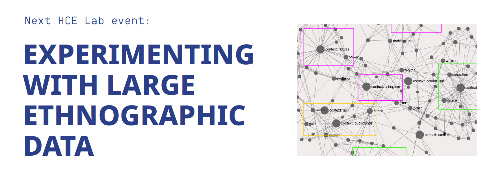
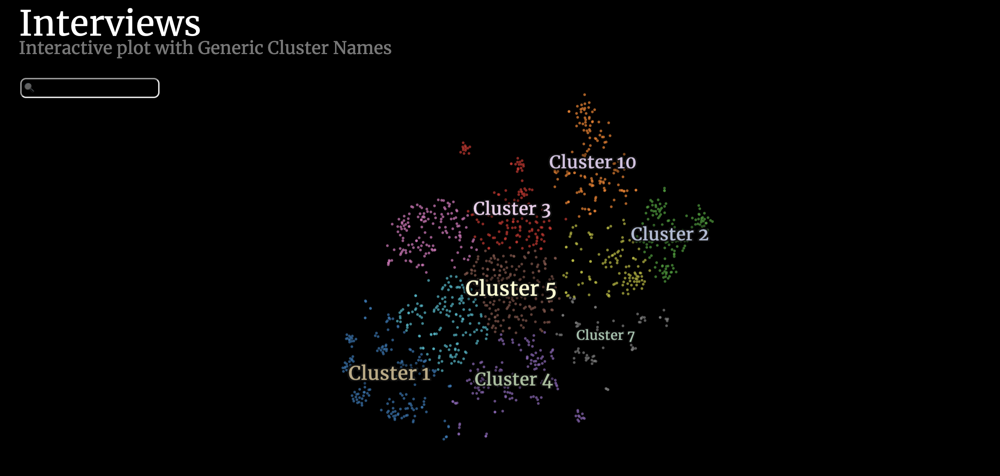
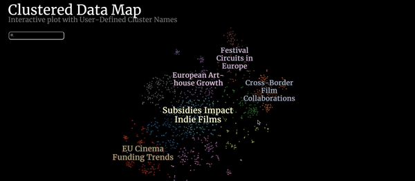
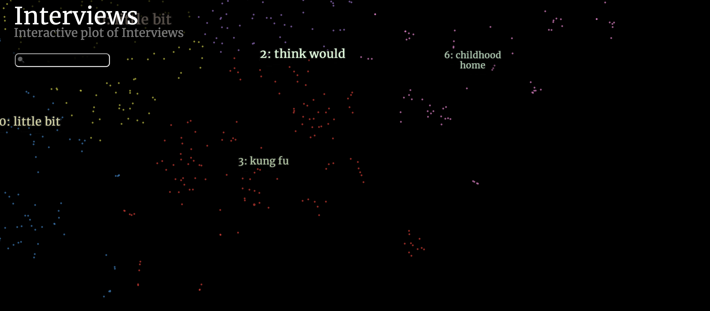

### Step 0: Step-by-Step Guide - Downloading Python and Formatting Your Data

[Download the workshop PDF](https://github.com/Human-Centered-Engineering-Lab/EXPERIMENTING-WITH-LARGE-ETHNOGRAPHIC-DATA-workshop/raw/main/Images/StepbyStep%20Prep_Workshop%2002-10_HCELab.pdf)

---

### Step 1: Generating Sentence Embeddings with Sentence Transformers

This script uses the `SentenceTransformers` library to generate sentence embeddings from any type of text. Here, we apply it to interview transcripts, enabling us to analyze how interviews relate based on their content. The text is transformed into numerical embeddings that capture semantic meaning, making them ideal for tasks like similarity detection or data clustering.

In this script, the default `SentenceTransformer` model is **paraphrase-multilingual-MiniLM-L12-v2**, which is trained on many different languages. However, you can easily change it to suit your needs. Here is a list of different [pre-trained models](https://sbert.net/docs/sentence_transformer/pretrained_models.html).

---

### Step 2: Visualizing Sentence Embeddings with DataMapPlot

Once the sentence embeddings are generated, the next step is to visualize them. This script uses [DataMapPlot](https://datamapplot.readthedocs.io/en/latest/) to create an interactive plot, showing how the embeddings are clustered and organized in a 2D space.

---

### Visualization 1: DataMapPlot without Labels

This first visualization is created without any labels. It shows how different clusters are formed based on the semantic similarity between interviews. The goal here is to explore the clusters and start identifying patterns in the data, without the influence of labels. Once we have a clear view of these clusters, we can move on to annotating them for further analysis.

---

### Visualization 2: DataMapPlot with User Annotation Labels

---

### Visualization 3: Automating Labels of Clusters (TF-IDF)

In this example, we demonstrate how machine learning can be used to automatically label the different clusters. Here, we use TF-IDF (Term Frequency-Inverse Document Frequency), a statistical method that evaluates how frequently a word appears in a document versus how commonly it appears across all documents. This is one of the simplest ways to name clusters, making it efficient for use without requiring significant computational power.

For more advanced methods, you could consider using [BERTopic](https://maartengr.github.io/BERTopic/index.html), or even combining BERTopic with an open-source generative language model, which can be run through tools like [Ollama](https://ollama.com/), to generate more nuanced automated cluster labels.

---

### Backup: Visualizing Your Data in CorText

If the script does not work, you can use [CorText](https://managerv2.cortext.net/) to explore your data. Here is a tutorial on how to use it. The tutorial is a bit old, and the data used in the video comes from Scopus. [Link to video](https://drive.google.com/file/d/1Z_l0QxRZtxmhDctnAvmEGEXk8OC_m9GC/view?usp=sharing)
